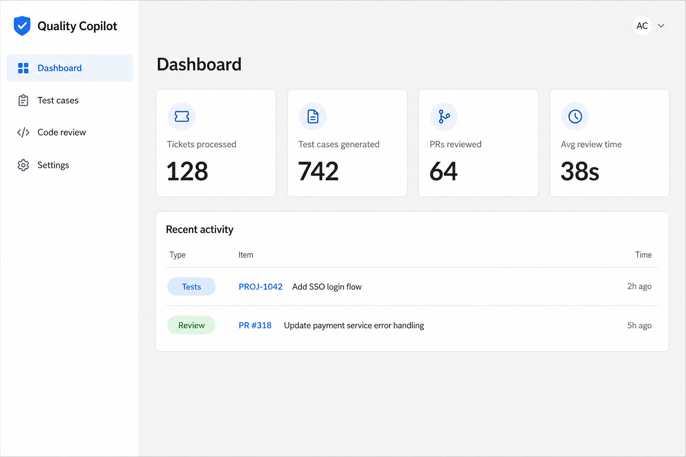

# Quality Copilot

[](LICENSE)
[](https://www.python.org/downloads/)
[](https://render.com/deploy?repo=https://github.com/amzadb/Quality_Copilot)

AI-assisted QA workflows: generate test cases from JIRA tickets, export to local files / JIRA / TestRail, and run AI-powered pull request code reviews.

[](https://render.com/deploy?repo=https://github.com/amzadb/Quality_Copilot)

> One-click deploy uses [`render.yaml`](render.yaml). After the API is live, set the web service `BACKEND_URL` to your API URL. Details: [docs/DEPLOY_RENDER.md](docs/DEPLOY_RENDER.md).



## What it does

| Capability | Description |
|------------|-------------|
| **Test cases** | Fetch a JIRA ticket, generate cases with Claude, edit inline, export DOCX/CSV, attach to JIRA, upload to TestRail |
| **Code review** | Load a Bitbucket/GitHub-style PR diff, generate review comments, triage findings |
| **Dashboard** | Activity summary and recent runs (resettable) |
| **Auth & settings** | JWT login / sign-up / password reset; per-user integration secrets in the database |

Stack: **FastAPI** backend (`backend/`, port 8000) + **NiceGUI** frontend (`frontend/`, port 9000). The UI calls `/api/v1` with a Bearer token and uses demo data only when the API is unreachable.

## Repository layout

```
Quality_Copilot/
├── backend/          # FastAPI REST API
├── frontend/         # NiceGUI web UI
├── docs/             # API contract, Render deploy guide, images
├── render.yaml       # Render Blueprint (API + web + Postgres)
├── LICENSE           # MIT
├── SECURITY.md       # Vulnerability reporting
└── CONTRIBUTING.md   # How to contribute
```

| Component | Stack | Default URL |
|-----------|-------|-------------|
| Backend | FastAPI, SQLAlchemy, Alembic, JWT | http://127.0.0.1:8000 |
| Frontend | NiceGUI, httpx | http://127.0.0.1:9000 |

## Quick start

```powershell
# Terminal 1 — Backend
cd backend
python -m venv .venv
.venv\Scripts\activate
pip install -r requirements.txt
copy .env.example .env
# Set JWT_SECRET in .env (required when DEBUG=false)
alembic upgrade head
uvicorn app.main:app --reload --host 127.0.0.1 --port 8000

# Terminal 2 — Frontend
cd frontend
python -m venv .venv
.venv\Scripts\activate
pip install -r requirements.txt
python -m app.main
```

Open **http://127.0.0.1:9000/login** — use **Sign up**, or set `ADMIN_PASSWORD` in the backend `.env` to seed an admin.

Useful backend URLs:

| URL | Purpose |
|-----|---------|
| http://127.0.0.1:8000/health | Health check |
| http://127.0.0.1:8000/docs | Swagger UI |
| http://127.0.0.1:8000/api/v1/... | Versioned API |

## Frontend pages

| Route | Description |
|-------|-------------|
| `/login` | Login, sign up, reset password |
| `/` | Dashboard — metrics and recent activity |
| `/test-cases` | JIRA → generate → edit → export |
| `/code-review` | PR → AI review → triage |
| `/settings` | Per-user JIRA, Git, TestRail, LLM config |

## Configuration

### Backend (`backend/.env`)

| Variable | Default | Description |
|----------|---------|-------------|
| `APP_NAME` | `Quality Copilot` | OpenAPI application title |
| `API_V1_PREFIX` | `/api/v1` | API base path |
| `DEBUG` | `false` | Debug mode |
| `DATABASE_URL` | `sqlite:///./quality_copilot.db` | SQLAlchemy URL (Postgres on Render) |
| `JWT_SECRET` | _(required)_ | Unique secret; app refuses insecure defaults when `DEBUG=false` |
| `ADMIN_PASSWORD` | _(empty)_ | Optional admin seed — no baked-in password |

### Frontend (`frontend/.env`)

| Variable | Default | Description |
|----------|---------|-------------|
| `APP_TITLE` | `Quality Copilot` | Browser tab title |
| `BACKEND_URL` | `http://127.0.0.1:8000` | Backend base URL |
| `API_V1_PREFIX` | `/api/v1` | API version prefix |
| `PORT` | `9000` | NiceGUI server port |
| `RELOAD` | `true` | Auto-reload on code changes |
| `STORAGE_SECRET` | local-dev default | NiceGUI session storage (set uniquely in production) |

Integration secrets are stored **per user** after login. `credentials.json` is only a legacy fallback. Secrets are never returned in full on GET.

## Deploy on Render

This stack needs long-running Python processes — **Render, not Vercel**.

[](https://render.com/deploy?repo=https://github.com/amzadb/Quality_Copilot)

1. Click the button (or: [Render](https://dashboard.render.com) → **New** → **Blueprint** → this repo).
2. After **quality-copilot-api** is live, set web env `BACKEND_URL` (or rely on Blueprint `BACKEND_HOST`) to `https://<your-api>.onrender.com`.
3. Open the web URL → `/login`.

Free-tier caveats (sleep/cold starts, Postgres): [docs/DEPLOY_RENDER.md](docs/DEPLOY_RENDER.md).

## Architecture

```
NiceGUI frontend (9000)
        │  HTTP /api/v1  (Bearer JWT)
        ▼
FastAPI backend (8000)
        │
        ├── api/routes/      Thin routers
        ├── services/        Orchestration (test cases, code review, settings, activity)
        ├── integrations/    JIRA, Git provider, TestRail, LLM clients
        ├── models/          SQLAlchemy persistence
        └── jobs/            Background tasks (MVP via BackgroundTasks)
```

## Status

| Layer | Status |
|-------|--------|
| **Frontend** | Login/register/reset, all pages, dialogs, Bearer client |
| **Backend** | Phase 0–3 + JWT auth, per-user settings, activity reset |

## Contributing & security

- [CONTRIBUTING.md](CONTRIBUTING.md) — setup, tests, branch naming, PRs
- [SECURITY.md](SECURITY.md) — how to report vulnerabilities privately
- [LICENSE](LICENSE) — MIT

## Further reading

- [backend/README.md](backend/README.md) — API overview, errors, testing
- [frontend/README.md](frontend/README.md) — UI structure and config
- [PROGRESS.md](PROGRESS.md) — Implementation tracker
- [docs/API_CONTRACT.md](docs/API_CONTRACT.md) — REST API contract (v1)
- [docs/DEPLOY_RENDER.md](docs/DEPLOY_RENDER.md) — Render Blueprint guide
